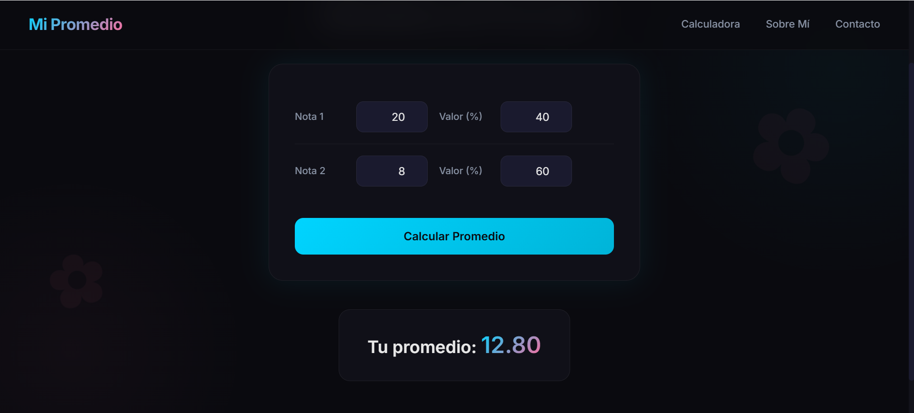

# Mi Promedio

Calculadora de promedios académicos con diseño elegante y minimalista. Aplica un estilo visual moderno con estética anime sutil inspirada en ambientes nocturnos y tranquilos.

## Descripción

**Mi Promedio** es una aplicación web ligera y elegante para calcular promedios académicos ponderados. Diseñada con un enfoque en la usabilidad y la estética visual, ofrece una experiencia moderna y agradable con un estilo dark mode inspirado en la estética de juegos como Wuthering Waves.

## Funcionalidades Principales

- **Cálculo de Promedio Ponderado**: Calcula el promedio de dos notas con sus respectivos porcentajes de peso.
- **Validación de Datos**: Verifica que los campos estén completos y que la suma de porcentajes sea 100%.
- **Diseño Responsivo**: Se adapta perfectamente a dispositivos móviles, tabletas y escritorio.
- **Menú Móvil**: Navegación hamburguesa con animaciones suaves para pantallas pequeñas.
- **Dark Mode Exclusivo**: Diseño oscuro elegante con colores cyan y sakura como acentos.
- **Animaciones Suaves**: Transiciones y efectos hover que mejoran la experiencia de usuario.

## Tecnologías Utilizadas

| Tecnología | Versión | Uso |
|------------|---------|-----|
| HTML5 | - | Estructura semántica |
| CSS3 | - | Estilos y diseño responsive |
| JavaScript (ES6+) | - | Lógica y interactividad |

## Instalación

1. Clona el repositorio:
   ```bash
   git clone https://github.com/tu-usuario/Mi-Promedio.git
   ```

2. Navega al directorio del proyecto:
   ```bash
   cd Mi-Promedio
   ```

3. Abre el archivo `index.html` en tu navegador favorito.

No se requiere instalación de dependencias ni servidores. La aplicación funciona directamente en el navegador.

## Ejecución

Simplemente abre `index.html` en cualquier navegador web moderno (Chrome, Firefox, Safari, Edge).

## Variables de Entorno

No se requieren variables de entorno. La aplicación es estática y funciona sin configuración adicional.

## Captura de Pantalla



## Estructura de Carpetas

```
Mi-Promedio/
├── index.html          # Archivo principal HTML
├── style.css           # Estilos CSS (dark mode, responsive)
├── script.js           # Lógica de JavaScript
├── README.md           # Documentación del proyecto
└── docs/
    └── screenshots/    # Capturas de pantalla
```

## Paleta de Colores

| Color | Hex | Uso |
|-------|-----|-----|
| Negro profundo | `#0a0a0f` | Fondo principal |
| Gris oscuro | `#12121a` | Fondo secundario |
| Cyan suave | `#00d4ff` | Color de acento |
| Sakura | `#ff6b9d` | Detalle secundario |
| Texto primario | `#e8e8e8` | Texto principal |
| Texto secundario | `#8892a4` | Texto secundario |

## Diseño Visual

El diseño sigue una estética **anime sutil y elegante** con:

- Modo oscuro exclusivo
- Bordes suaves y redondeados
- Sombras ligeras y translúcidas
- Transparencias sutiles (glassmorphism)
- Gradientes oscuros
- Animaciones suaves (fade, hover, transitions)
- Sakuras discretas como elemento decorativo
- Colores cyan y rosado como acentos

## Responsive Design

La aplicación se adapta a diferentes tamaños de pantalla:

- **Desktop** (>768px): Layout completo con navegación horizontal
- **Mobile** (≤768px): Menú hamburguesa, layout apilado, formulario optimizado

## Navegación

- [Calculadora](#calculadora) - Sección principal

## Licencia

Este proyecto es de uso abierto. Puedes modificarlo y usarlo según tus necesidades.

---

**Nota**: Este proyecto fue diseñado con foco en la elegancia, minimalismo y una estética anime sutil que se sienta premium y moderna.